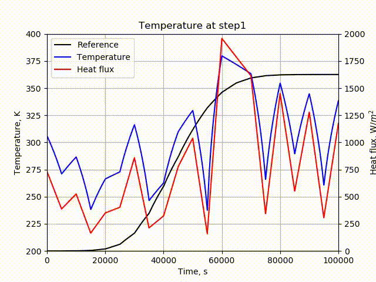

# Borealis

Bayesian optimization for finding realizable solutions for discretized equation


# Code description

`Borealis` solves an inverse problem in various mathematical models based on the Bayesian optimization and swarm intelligence algorithm.
This software is designed to evaluate an objective function based on the user's program output data and to optimize by changing input parameters.
User programs serve as adapters, allowing `Borealis` to execute and optimize via the user's input configuration file.
Templates for adapter programs are provided.
The Bayesian optimization, the particle swarm optimization (PSO) algorithm, the artificial bee colony (ABC) algorithm, and the genetic algorithm (GA) are implemented as optimizers.
PSO also supports distributed parallel processing using `mpi4py`.
The following animation is an example of optimization for estimating input heat flux in heat conduction analysis.



# How to start optimization

## Run `Borealis`

```console
python3 src/borealis.py
```

Tutorial case: `testcase/work*`
The tutorials recommended are `testcase/work_example_externalcode` and `testcase/work_simple_function`

## Configuration file

Optimization by `Borealis` is controled by the configuration file: `borealis.yml`.

## External code

When an external code, for example, `Tacode`, is used, the pass needs to be specified in `borealis.yml` and file permissions also be given.

## Requirements

`Borealis` requires the following packages:

- numpy (>=1.22.3)
- yaml (>= 5.3.1)
- GPyOpt (>= 1.2.6)
- mpi4py (>=3.0.3)


# Contact:

Yusuke Takahashi, Hokkaido University

ytakahashi@eng.hokudai.ac.jp


# References

- Yusuke Takahashi, Masahiro Saito, Nobuyuki Oshima, and Kazuhiko Yamada, “Trajectory Reconstruction for Nanosatellite in Very Low Earth Orbit Using Machine Learning.” Acta Astronautica 194: 301–8. 2022. https://doi.org/https://doi.org/10.1016/j.actaastro.2022.02.010.
